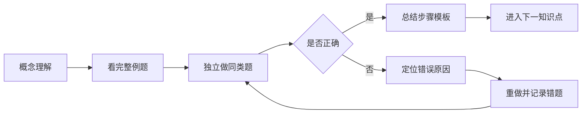

# 运筹学

本仓库用于记录运筹学课程的学习过程、讲义、练习、错题与阶段复习资料，并通过 Git 提交保留完整学习轨迹。

## 考试范围

- 第1章：线性规划
- 第2章：对偶理论
- 第3章：整数规划
- 第4章：运输问题
- 第8章：图论

## 三天学习目标

总时长：**3天 × 6小时 = 18小时**。

目标是从零基础建立完整知识框架，优先掌握考试高频题型、核心算法和标准解题步骤。

## 总学习路线


## 三天时间安排

### 第1天：线性规划核心基础（6小时）

- 1小时：线性规划概念与建模
- 1小时：图解法与标准形
- 1小时：基、基本解与单纯形表
- 1.5小时：单纯形法完整步骤
- 0.5小时：大M法与两阶段法概览
- 1小时：练习、纠错与复盘

### 第2天：对偶理论与运输问题（6小时）

- 1小时：对偶问题的写法
- 1小时：弱对偶、强对偶与互补松弛
- 1小时：对偶单纯形法与敏感性分析
- 1小时：运输问题建模与初始解
- 1.5小时：位势法、检验数与闭回路调整
- 0.5小时：练习与复盘

### 第3天：整数规划与图论（6小时）

- 0.75小时：整数规划与松弛问题
- 1小时：分枝定界法
- 0.75小时：指派问题与匈牙利法
- 1小时：图论基本概念与树
- 1.5小时：最短路、中国邮递员与最大流
- 1小时：综合模拟与总复盘

> 建议每学习50分钟，休息10分钟。

## 学习清单

### 第1章：线性规划

- [ ] 理解决策变量、目标函数和约束条件
- [ ] 会把文字题转化为线性规划模型
- [ ] 理解可行解、可行域、最优解和最优值
- [ ] 会使用双变量图解法
- [ ] 会判断唯一最优、无穷多最优、无界和不可行
- [ ] 会把一般形式化为标准形
- [ ] 理解基、基本解和基本可行解
- [ ] 会看懂并填写单纯形表
- [ ] 会计算检验数
- [ ] 会选择入基变量和出基变量
- [ ] 会完成单纯形法完整迭代
- [ ] 了解大M法和两阶段法

### 第2章：对偶理论

- [ ] 会由原问题写出对偶问题
- [ ] 掌握变量与约束的对应关系
- [ ] 理解弱对偶和强对偶
- [ ] 会使用互补松弛条件
- [ ] 理解影子价格
- [ ] 理解对偶单纯形法的适用场景
- [ ] 了解敏感性分析的主要类型

### 第3章：整数规划

- [ ] 区分纯整数、混合整数和0-1规划
- [ ] 理解松弛线性规划问题
- [ ] 会画分枝定界树
- [ ] 会判断剪枝条件
- [ ] 了解割平面法的基本思想
- [ ] 会用匈牙利法解决指派问题

### 第4章：运输问题

- [ ] 会建立运输问题模型
- [ ] 会判断平衡型和不平衡型运输问题
- [ ] 会用西北角法求初始解
- [ ] 会用最小元素法求初始解
- [ ] 会用位势法计算检验数
- [ ] 会用闭回路法调整运输方案
- [ ] 会完整完成表上作业法

### 第8章：图论

- [ ] 掌握顶点、边、度数、路、迹、圈和连通等概念
- [ ] 会使用握手定理
- [ ] 理解树和支撑树
- [ ] 会求最小生成树
- [ ] 会判断欧拉图和半欧拉图
- [ ] 理解中国邮递员问题
- [ ] 会使用Dijkstra算法求最短路
- [ ] 理解旅行售货员问题的基本模型
- [ ] 会用Ford-Fulkerson思想求最大流

## 学习闭环



## 三天结束后的验收标准

- [ ] 能独立建立一个线性规划模型
- [ ] 能独立完成双变量图解法
- [ ] 能完成基础单纯形表迭代
- [ ] 能正确写出对偶问题
- [ ] 能使用互补松弛条件
- [ ] 能完整求解一个运输问题
- [ ] 能画出分枝定界过程
- [ ] 能用匈牙利法做指派题
- [ ] 能求最小生成树和最短路
- [ ] 能求基础最大流问题
- [ ] 能在限定时间内完成一套模拟题
- [ ] 已形成个人错题清单和公式清单

## 学习原则

1. 从零基础开始，不默认掌握运筹学术语。
2. 每节课按“概念 → 例题 → 练习 → 复盘”推进。
3. 每次新增讲义、作业或复盘都单独提交。
4. 错题与薄弱点持续记录在 `PROGRESS.md`。

## 仓库结构

```text
README.md                 学习路线与总清单
SYLLABUS.md               总体课程路线
PROGRESS.md               学习进度与掌握情况
CHANGELOG.md              更新日志
study-plan/               详细学习计划
lessons/                  分节讲义
exercises/                练习与答案
exam-prep/                考前复习资料
sources/                  资料索引
```

## 当前状态

- 已完成：仓库初始化与三天学习路线设计
- 下一课：第1课——什么是线性规划
