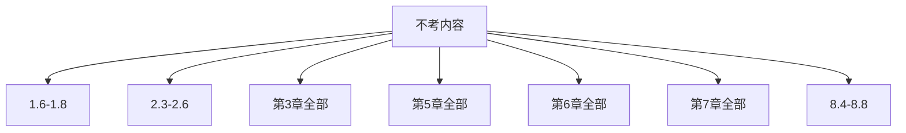
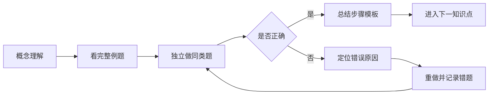

# 运筹学

本仓库用于记录运筹学课程的学习过程、讲义、练习、错题、课件索引与阶段复习资料，并通过 Git 提交保留完整学习轨迹。

## 最新考试范围

根据最新消息，以下内容**不考**：

- 第1章：1.6、1.7、1.8
- 第2章：2.3、2.4、2.5、2.6
- 第3章：全部
- 第5章：全部
- 第6章：全部
- 第7章：全部
- 第8章：8.4、8.5、8.6、8.7、8.8

因此当前复习范围调整为：

- **第1章：1.1—1.5、1.9—1.13**
- **第2章：2.1—2.2**
- **第4章：全部**
- **第8章：8.1—8.3**

> 后续教学、练习和模拟题都以此范围为准。

## 三天学习目标

总时长：**3天 × 6小时 = 18小时**。

目标是从零基础出发，优先掌握确定会考的知识点、标准计算步骤和常见题型。

## 总学习路线


## 三天时间安排

### 第1天：第1章基础与图解法（6小时）

- 1小时：1.1 线性规划问题与建模
- 1.5小时：1.2 图解法
- 1小时：1.3 标准形
- 1小时：1.4 线性规划问题的“解”
- 0.5小时：1.5 几何特征
- 1小时：练习、纠错与复盘

### 第2天：单纯形法、对偶理论（6小时）

- 1小时：1.9 最优性的检验
- 1.5小时：1.10 单纯形法步骤
- 0.5小时：1.11 单纯形法进一步讨论
- 1小时：1.12 大M法与1.13两阶段法
- 1小时：2.1 对偶问题
- 1小时：2.2 对偶问题的基本性质与互补松弛

### 第3天：运输问题与图论（6小时）

- 1小时：4.1 运输问题模型与运输表
- 1小时：4.2 初始基本可行解
- 1小时：4.3 最优性检验
- 1小时：4.4 修正与4.5表上作业法
- 1小时：8.1—8.2 图论起源与基本概念
- 1小时：8.3 树与最小生成树、综合复盘

> 建议每学习50分钟，休息10分钟。

## 学习清单

### 第1章：线性规划

#### 1.1—1.5

- [ ] 理解决策变量、目标函数和约束条件
- [ ] 会把文字题转化为线性规划模型
- [ ] 理解可行解、可行域、最优解和最优值
- [ ] 会使用双变量图解法
- [ ] 会判断唯一最优、无穷多最优、无界和不可行
- [ ] 会把一般形式化为标准形
- [ ] 理解基、基本解、基本可行解和基本最优解
- [ ] 理解凸集、顶点及线性规划基本定理

#### 1.9—1.13

- [ ] 会计算和判断检验数
- [ ] 会选择入基变量和出基变量
- [ ] 会完成单纯形法完整迭代
- [ ] 理解唯一最优、无穷多最优和无界情形
- [ ] 会使用大M法
- [ ] 会使用两阶段法

### 第2章：对偶理论

- [ ] 会由原问题写出对偶问题
- [ ] 掌握变量与约束的对应关系
- [ ] 理解对称型与非对称型对偶问题
- [ ] 理解弱对偶和强对偶
- [ ] 会使用互补松弛条件
- [ ] 掌握课件中的8条基本性质

### 第4章：运输问题

- [ ] 会建立运输问题模型
- [ ] 会判断平衡型和不平衡型运输问题
- [ ] 理解运输表、基本格子集和孤立格子集
- [ ] 会用西北角法求初始解
- [ ] 会用最小元素法求初始解
- [ ] 会用位势法计算检验数
- [ ] 会用闭回路法调整运输方案
- [ ] 会完整完成表上作业法

### 第8章：图论

- [ ] 了解哥尼斯堡七桥问题与图论起源
- [ ] 掌握顶点、边、度数、路、迹、圈和连通等概念
- [ ] 会使用图论第一定理与握手定理
- [ ] 理解子图、支撑子图和图的矩阵表示
- [ ] 理解树、树叶、支撑树
- [ ] 会使用破圈法和避圈法
- [ ] 会求最小权支撑树

## 明确排除的内容



## 学习闭环



## 三天结束后的验收标准

- [ ] 能独立建立一个线性规划模型
- [ ] 能独立完成双变量图解法
- [ ] 能把线性规划化为标准形
- [ ] 能识别基本解与基本可行解
- [ ] 能完成基础单纯形表迭代
- [ ] 能使用大M法或两阶段法处理人工变量
- [ ] 能正确写出对偶问题
- [ ] 能使用互补松弛条件
- [ ] 能完整求解一个运输问题
- [ ] 能使用握手定理
- [ ] 能求最小权支撑树
- [ ] 已形成个人错题清单和公式清单

## 学习原则

1. 从零基础开始，不默认掌握运筹学术语。
2. 每节课按“概念 → 例题 → 练习 → 复盘”推进。
3. 每次新增讲义、作业或复盘都单独提交。
4. 错题与薄弱点持续记录在 `PROGRESS.md`。
5. 所有内容严格服从最新考试范围。

## 仓库结构

```text
README.md                 最新考试范围、学习路线与总清单
SYLLABUS.md               总体课程路线
PROGRESS.md               学习进度与掌握情况
CHANGELOG.md              更新日志
study-plan/               详细学习计划
lessons/                  分节讲义
exercises/                练习与答案
exam-prep/                考前复习资料
sources/                  电子书、课件与资料索引
```

## 当前状态

- 已完成：仓库初始化、三天学习路线设计、考试范围修订
- 下一课：第1课——1.1 线性规划问题与建模
