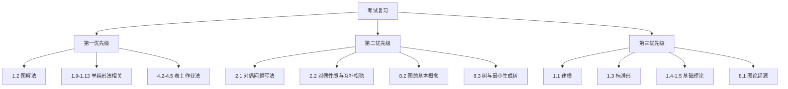

# 运筹学考试范围（最新确认）

## 一、确定考试内容

### 第1章 线性规划

- 1.1 线性规划问题
- 1.2 图解法
- 1.3 线性规划问题的标准形
- 1.4 线性规划问题的“解”
- 1.5 线性规划问题的几何特征
- 1.9 最优性的检验
- 1.10 单纯形法的步骤
- 1.11 单纯形法的进一步讨论
- 1.12 大M法
- 1.13 两阶段法

### 第2章 对偶理论

- 2.1 对偶问题
- 2.2 对偶问题的基本性质

### 第4章 运输问题

- 4.1 运输问题与运输表
- 4.2 初始基本可行解
- 4.3 最优性的检验
- 4.4 修正
- 4.5 表上作业法

### 第8章 图论

- 8.1 图论的起源
- 8.2 图的基本概念
- 8.3 树

## 二、明确不考内容

- 第1章：1.6、1.7、1.8
- 第2章：2.3、2.4、2.5、2.6
- 第3章：全部
- 第5章：全部
- 第6章：全部
- 第7章：全部
- 第8章：8.4、8.5、8.6、8.7、8.8

## 三、复习优先级

## 四、范围变更原则

后续讲义、练习、模拟题和复盘均以本文件为唯一范围基准。若教师再次调整范围，应先更新本文件，再同步更新 `README.md`、`SYLLABUS.md` 和 `PROGRESS.md`。
