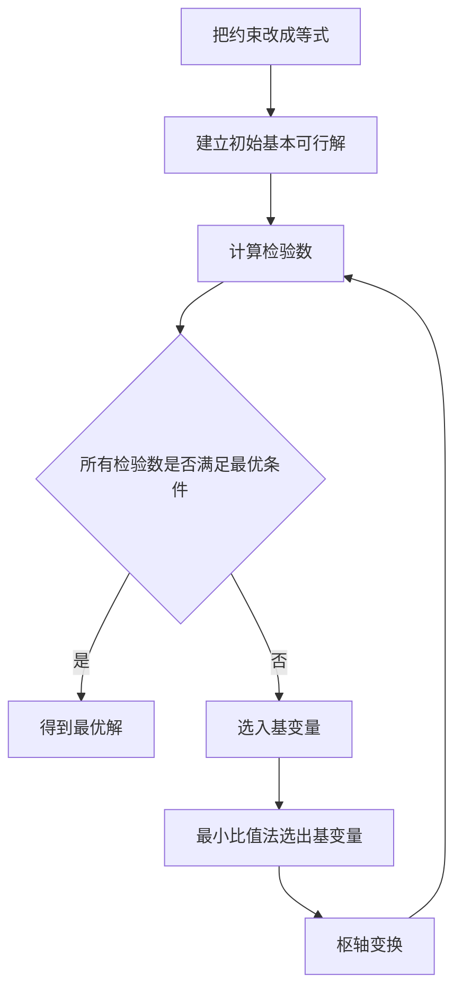

# 第4课：单纯形法第一讲——松弛变量、单纯形表、入基与出基

## 学习目标

完成本课后，应能：

1. 会把 `≤` 约束改写成等式。
2. 理解松弛变量的含义。
3. 读懂最基础的单纯形表。
4. 会用检验数选择入基变量。
5. 会用最小比值法选择出基变量。
6. 理解一次枢轴变换在做什么。

---

## 一、先解决一个关键问题：为什么要加松弛变量

单纯形法处理的是等式组，而线性规划常写成不等式。

例如：

```text
x1 + x2 <= 4
```

加入松弛变量 `x3`：

```text
x1 + x2 + x3 = 4
x3 >= 0
```

`x3` 表示“没有用完的资源”。

例如若 `x1 + x2 = 3`，则：

```text
x3 = 1
```

说明还有 1 单位资源没有使用。

同理：

```text
2x1 + x2 <= 6
```

改写为：

```text
2x1 + x2 + x4 = 6
x4 >= 0
```

---

## 二、例题

求解：

```text
max z = 3x1 + 2x2

s.t.
    x1 + x2 <= 4
    2x1 + x2 <= 6
    x1, x2 >= 0
```

加入松弛变量：

```text
x1 + x2 + x3 = 4
2x1 + x2 + x4 = 6
x1, x2, x3, x4 >= 0
```

初始时令：

```text
x1 = 0, x2 = 0
```

则：

```text
x3 = 4, x4 = 6
```

所以初始基本可行解是：

```text
(0, 0, 4, 6)
```

初始基变量为 `x3、x4`，非基变量为 `x1、x2`。

---

## 三、最基础的单纯形表

采用 `Cj - Zj` 作为检验数：

| Cb | 基变量 | b | x1 | x2 | x3 | x4 |
|---:|---|---:|---:|---:|---:|---:|
| 0 | x3 | 4 | 1 | 1 | 1 | 0 |
| 0 | x4 | 6 | 2 | 1 | 0 | 1 |
|  | Cj-Zj |  | 3 | 2 | 0 | 0 |

这里：

- `Cj`：目标函数中各变量的系数；
- `Cb`：当前基变量在目标函数中的系数；
- `Zj`：由当前基变量计算得到的系数；
- `Cj-Zj`：检验数。

初始基变量是松弛变量，目标系数都为 0，因此初始 `Zj = 0`。

---

## 四、如何选入基变量

对于最大化问题，采用 `Cj-Zj` 时：

> 选择最大的正检验数对应的变量入基。

当前：

```text
x1 的检验数 = 3
x2 的检验数 = 2
```

因为 `3 > 2`，所以：

```text
x1 入基
```

直观理解：增加 `x1` 对目标函数改善得最快。

---

## 五、如何选出基变量

确定入基列后，使用最小比值法：

```text
θ = b / 入基列中的正数
```

只计算入基列中严格大于 0 的元素。

当前入基列是 `x1`：

第一行：

```text
4 / 1 = 4
```

第二行：

```text
6 / 2 = 3
```

最小正比值为 3，因此第二行对应的基变量 `x4` 出基。

所以：

```text
x1 入基，x4 出基
```

交叉位置上的数 `2` 称为主元或枢轴元素。

---

## 六、为什么用最小比值

随着入基变量 `x1` 增大，资源会逐渐被消耗。

- 第一条约束最多允许 `x1` 增加到 4；
- 第二条约束最多允许 `x1` 增加到 3。

第二条约束先达到极限，所以 `x4` 先降为 0并出基。

最小比值法的本质是：

> 在保持所有变量非负的前提下，让入基变量尽可能增大。

---

## 七、一次枢轴变换

主元是第二行 `x1` 列中的 2。

### 第一步：主元变成 1

第二行全部除以 2：

```text
x1 + 0.5x2 + 0x3 + 0.5x4 = 3
```

### 第二步：入基列其余元素变成 0

第一行减去新的第二行：

```text
0x1 + 0.5x2 + x3 - 0.5x4 = 1
```

新的表为：

| Cb | 基变量 | b | x1 | x2 | x3 | x4 |
|---:|---|---:|---:|---:|---:|---:|
| 0 | x3 | 1 | 0 | 0.5 | 1 | -0.5 |
| 3 | x1 | 3 | 1 | 0.5 | 0 | 0.5 |

新的基本可行解：

```text
x1 = 3, x3 = 1
x2 = 0, x4 = 0
```

即：

```text
(3, 0, 1, 0)
```

目标函数值：

```text
z = 3×3 + 2×0 = 9
```

---

## 八、重新计算检验数

当前基变量为 `x3、x1`，对应：

```text
Cb = 0, 3
```

计算 `Zj`：

- `x1` 列：`0×0 + 3×1 = 3`
- `x2` 列：`0×0.5 + 3×0.5 = 1.5`
- `x3` 列：`0×1 + 3×0 = 0`
- `x4` 列：`0×(-0.5) + 3×0.5 = 1.5`

所以 `Cj-Zj`：

```text
x1: 3 - 3 = 0
x2: 2 - 1.5 = 0.5
x3: 0 - 0 = 0
x4: 0 - 1.5 = -1.5
```

因为 `x2` 的检验数仍为正数，所以还没有达到最优，下一轮应让 `x2` 入基。

---

## 九、最优性判别

对于最大化问题，采用 `Cj-Zj` 时：

```text
若所有检验数 <= 0，则当前解最优。
```

若还有正数，则继续迭代。

注意：有些教材使用 `Zj-Cj`，那时判别符号相反。考试时必须与课件表头保持一致。

---

## 十、单纯形法固定流程



---

## 十一、必须记住的规则

采用 `Cj-Zj` 且目标为最大化时：

```text
入基：选最大的正检验数
出基：选最小的正比值 b/aij
主元：入基列与出基行的交点
最优：所有检验数 <= 0
```

---

## 十二、常见错误

1. 忘记给每个 `≤` 约束添加一个不同的松弛变量。
2. 把松弛变量的目标系数写成 1，正确应为 0。
3. 最小比值法把 0 或负数也参与计算。
4. 选择最大比值而不是最小正比值。
5. 主元行归一化后，忘记把入基列其他元素消成 0。
6. 混淆 `Cj-Zj` 与 `Zj-Cj` 的判别规则。
