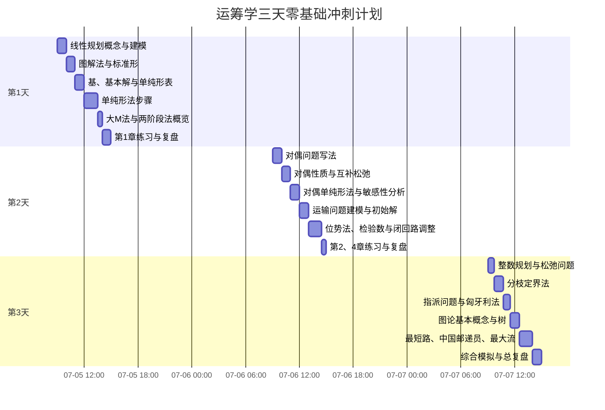
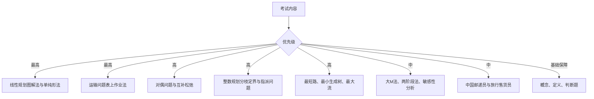
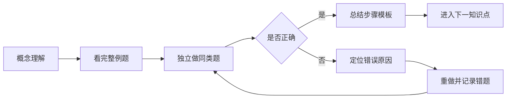

# 运筹学三天零基础冲刺学习大纲

> 总时长：3天 × 6小时 = 18小时  
> 考试范围：第1、2、3、4、8章  
> 学习目标：从零基础建立完整框架，优先掌握高频题型、核心算法和考试步骤。

## 一、总学习路线

## 二、三天时间安排

> 时间可根据实际开始时间整体平移；每学习50分钟，建议休息10分钟。

## 三、每天详细任务清单

### 第1天：线性规划核心基础（6小时）

目标：能读懂线性规划模型，会图解法，理解单纯形法的基本步骤。

- [ ] 理解决策变量、目标函数、约束条件
- [ ] 会把文字题翻译成数学模型
- [ ] 理解可行解、可行域、最优解、最优值
- [ ] 会解双变量线性规划图解题
- [ ] 会判断唯一最优、无穷多最优、无界、不可行
- [ ] 会把一般形式化为标准形
- [ ] 理解基、基本解、基本可行解
- [ ] 会看懂单纯形表
- [ ] 会计算检验数
- [ ] 会选择入基变量与出基变量
- [ ] 会完成至少1道单纯形法完整计算题
- [ ] 了解大M法和两阶段法分别解决什么问题
- [ ] 完成第1天练习并记录错题

### 第2天：对偶理论与运输问题（6小时）

目标：会写对偶问题，会用互补松弛；能完整做一道运输问题。

- [ ] 会由原问题写出对偶问题
- [ ] 掌握变量与约束之间的对应关系
- [ ] 理解弱对偶和强对偶
- [ ] 会使用互补松弛条件判断最优解
- [ ] 理解影子价格的含义
- [ ] 理解对偶单纯形法的使用场景
- [ ] 了解敏感性分析的主要变化类型
- [ ] 会建立运输问题模型
- [ ] 会判断平衡型与不平衡型运输问题
- [ ] 会用西北角法求初始基本可行解
- [ ] 会用最小元素法求初始基本可行解
- [ ] 会用位势法求检验数
- [ ] 会用闭回路法调整运输方案
- [ ] 会完整完成表上作业法
- [ ] 完成第2天练习并记录错题

### 第3天：整数规划与图论（6小时）

目标：掌握整数规划常见算法，能处理树、最短路、邮递员和最大流问题。

- [ ] 区分纯整数、混合整数和0-1规划
- [ ] 理解松弛线性规划问题
- [ ] 会画分枝定界树
- [ ] 会判断剪枝条件
- [ ] 了解割平面法的基本思想
- [ ] 会用匈牙利法解指派问题
- [ ] 掌握顶点、边、度数、路、迹、圈、连通等概念
- [ ] 会使用握手定理
- [ ] 理解树与支撑树
- [ ] 会求最小生成树
- [ ] 会判断欧拉图和半欧拉图
- [ ] 理解中国邮递员问题的基本方法
- [ ] 会使用Dijkstra算法求最短路
- [ ] 理解旅行售货员问题的基本模型
- [ ] 会用Ford-Fulkerson思想求最大流
- [ ] 完成一套综合模拟题
- [ ] 整理最终错题清单和公式清单

## 四、应试优先级

## 五、每个知识点的学习闭环

## 六、三天结束后的验收标准

- [ ] 能独立建立一个线性规划模型
- [ ] 能独立完成双变量图解法
- [ ] 能看懂并完成基础单纯形表迭代
- [ ] 能正确写出对偶问题
- [ ] 能使用互补松弛条件
- [ ] 能完整求解一个运输问题
- [ ] 能画出分枝定界过程
- [ ] 能用匈牙利法做指派题
- [ ] 能求最小生成树和最短路
- [ ] 能求基础最大流问题
- [ ] 能在限定时间内完成一套模拟题
- [ ] 已形成个人错题清单与公式清单

## 七、学习记录规则

每完成一个学习模块，应同步更新：

1. `PROGRESS.md`：掌握度与当前进度
2. `CHANGELOG.md`：新增讲义、练习和复盘记录
3. `lessons/`：每节课讲义
4. `exercises/`：练习、答案和错题

每个阶段使用独立 Git 提交，确保学习过程可追溯。
